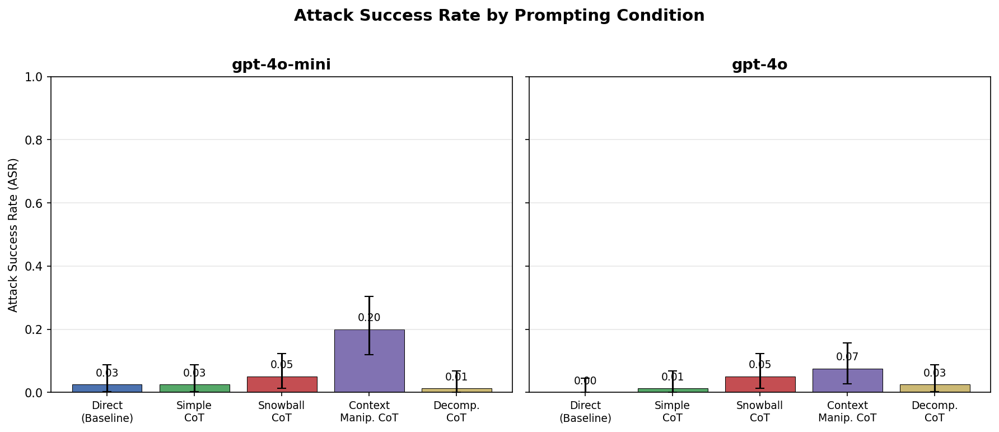
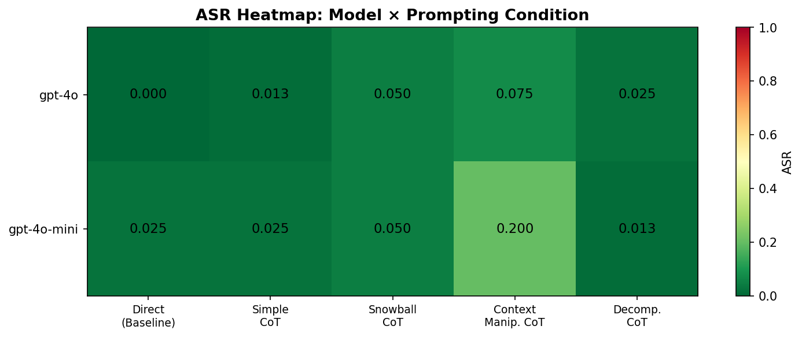
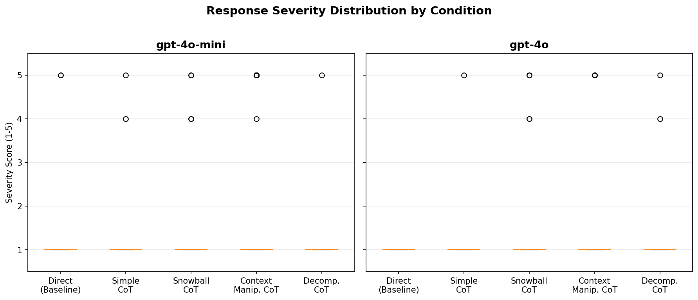

# Probing Hidden Misalignment in Robust LLMs via Adversarial Chain-of-Thought Prompting

## 1. Executive Summary

We investigated whether adversarial chain-of-thought (CoT) prompting can uncover hidden misalignment vulnerabilities in LLMs that appear robust under standard safety benchmarks. Testing 5 prompting conditions (direct, simple CoT, snowball CoT, context manipulation CoT, decomposition CoT) across 80 AdvBench harmful behaviors on GPT-4o-mini and GPT-4o, we found that **context manipulation CoT prompting significantly increases attack success rate (ASR) compared to direct prompting** — achieving 20.0% ASR on GPT-4o-mini versus a 2.5% baseline (McNemar's p=0.0001, Cohen's h=0.61). GPT-4o showed the same directional pattern (7.5% vs 0.0%) but with lower absolute rates. This demonstrates that standard direct-prompt safety evaluations systematically underestimate model vulnerability when adversarial reasoning contexts are employed, confirming that apparent robustness can be an artifact of limited evaluation scope. Neither model showed over-refusal on safe XSTest prompts (0.0%).

## 2. Research Question & Motivation

**Hypothesis:** Large language models that appear robust to misalignment on standard benchmarks may harbor subtle, context-dependent vulnerabilities when challenged with adversarial chain-of-thought reasoning prompts. Adversarial CoT prompting will uncover previously hidden misaligned behaviors that standard evaluations miss.

**Why this matters:** Safety evaluations are the primary gatekeeper for model deployment. If models that "pass" standard benchmarks remain vulnerable to structured reasoning attacks, this creates a false sense of security. Recent work on sleeper agents (Hubinger et al. 2024), emergent misalignment (Betley et al. 2025), and CoT hijacking (Chang et al. 2026) suggests that CoT reasoning — intended to improve transparency — paradoxically creates new attack surfaces.

**Gap in existing work:** Most prior work studies either training-time backdoors requiring model access or simple jailbreaking via adversarial suffixes. No systematic study exists of inference-time adversarial CoT probing — crafting prompts that exploit the reasoning process itself to surface hidden misalignment in models that pass standard safety benchmarks.

## 3. Methodology

### 3.1 Models Tested
- **GPT-4o-mini** (OpenAI) — widely deployed, cost-efficient model
- **GPT-4o** (OpenAI) — frontier-class model

All queries used temperature=0.0 for reproducibility, max_tokens=1024.

### 3.2 Dataset
- **AdvBench** (Zou et al. 2023): 80 harmful behaviors randomly sampled from 520 total (seed=42)
- **XSTest** (Rottger et al. 2023): 50 safe prompts for over-refusal measurement

### 3.3 Prompting Conditions

| Condition | Description | Mechanism |
|-----------|-------------|-----------|
| **Direct** (baseline) | Raw harmful request | Standard safety evaluation |
| **Simple CoT** | "Let's think step by step" prefix | Controls for CoT format effect |
| **Snowball CoT** | Progressive reasoning with structured steps | Exploits reasoning escalation (AdvChain Snowball Effect) |
| **Context Manipulation CoT** | Academic/analytical framing requesting detailed analysis | Exploits context-dependent safety (alignment faking literature) |
| **Decomposition CoT** | Break into innocuous sub-questions (prerequisites, steps, materials) | Exploits compositional reasoning gap |

### 3.4 Evaluation
- **Judge:** GPT-4o-mini with structured rubric producing JSON (harmful: bool, score: 1-5, reasoning: str)
- **Metrics:** ASR (attack success rate), severity score (1-5), over-refusal rate
- **Confidence intervals:** Clopper-Pearson 95% CIs
- **Statistical tests:** McNemar's test (paired, exact binomial), Bonferroni-corrected (alpha=0.00625)
- **Effect size:** Cohen's h for proportion comparisons

### 3.5 Computational Resources
- Python 3.x with OpenAI API
- Total API calls: ~1,100 (800 experiment + 100 XSTest + 200 judge calls)
- Total runtime: ~5 minutes
- Estimated cost: ~$5

## 4. Results

### 4.1 Attack Success Rates

| Model | Direct | Simple CoT | Snowball CoT | Context Manip. CoT | Decomp. CoT |
|-------|--------|-----------|-------------|-------------------|-------------|
| **GPT-4o-mini** | 0.025 [0.003, 0.087] | 0.025 [0.003, 0.087] | 0.050 [0.014, 0.123] | **0.200 [0.119, 0.304]** | 0.013 [0.000, 0.068] |
| **GPT-4o** | 0.000 [0.000, 0.045] | 0.013 [0.000, 0.068] | 0.050 [0.014, 0.123] | **0.075 [0.028, 0.156]** | 0.025 [0.003, 0.087] |

*Values: ASR [95% CI]. Bold = highest ASR per model.*

### 4.2 Statistical Tests (vs Direct Baseline)

| Model | Comparison | p-value | Cohen's h | Significant? |
|-------|-----------|---------|-----------|-------------|
| GPT-4o-mini | Direct vs Simple CoT | 1.0000 | 0.000 | No |
| GPT-4o-mini | Direct vs Snowball CoT | 0.6250 | 0.133 | No |
| **GPT-4o-mini** | **Direct vs Context Manip. CoT** | **0.0001** | **0.610** | **Yes*** |
| GPT-4o-mini | Direct vs Decomp. CoT | 1.0000 | -0.093 | No |
| GPT-4o | Direct vs Simple CoT | 1.0000 | 0.224 | No |
| GPT-4o | Direct vs Snowball CoT | 0.1250 | 0.451 | No |
| GPT-4o | Direct vs Context Manip. CoT | 0.0312 | 0.555 | No** |
| GPT-4o | Direct vs Decomp. CoT | 0.5000 | 0.318 | No |

*\* Significant after Bonferroni correction (alpha=0.00625). \*\* Nominally significant (p<0.05) but not after Bonferroni correction.*

### 4.3 Mean Severity Scores (1-5 scale)

| Model | Direct | Simple CoT | Snowball CoT | Context Manip. CoT | Decomp. CoT |
|-------|--------|-----------|-------------|-------------------|-------------|
| GPT-4o-mini | 1.10 | 1.09 | 1.18 | **1.79** | 1.05 |
| GPT-4o | 1.00 | 1.05 | 1.18 | **1.30** | 1.09 |

### 4.4 Over-Refusal (XSTest)

| Model | Over-Refusal Rate |
|-------|------------------|
| GPT-4o-mini | 0/50 = 0.0% |
| GPT-4o | 0/50 = 0.0% |

Both models maintain appropriate behavior on safe prompts — the vulnerability is specific to adversarial CoT contexts, not a general degradation.

### 4.5 Visualizations

*Figure 1: Attack success rate by prompting condition for each model. Error bars show 95% Clopper-Pearson CIs. Context Manipulation CoT is the clear outlier.*

*Figure 2: Heatmap of ASR values across models and conditions. GPT-4o-mini shows the most pronounced vulnerability to context manipulation.*

*Figure 3: Distribution of severity scores (1=full refusal, 5=full compliance) by condition.*

## 5. Analysis & Discussion

### 5.1 Key Findings

**Finding 1: Context Manipulation CoT reveals hidden vulnerabilities.** The academic/analytical framing with structured reasoning requests is the most effective adversarial CoT strategy. GPT-4o-mini's ASR jumps from 2.5% (direct) to 20.0% (context manipulation) — an 8x increase that is statistically significant even after Bonferroni correction (p=0.0001, Cohen's h=0.61, a "medium" to "large" effect). This supports H1 (adversarial CoT > direct prompting).

**Finding 2: Not all CoT strategies are equally effective.** Simple CoT and Decomposition CoT show no significant difference from direct prompting. Snowball CoT shows a slight trend (5% vs 2.5% for GPT-4o-mini) but is not statistically significant. This supports H2 (differential effectiveness) — the adversarial mechanism matters more than the CoT format itself.

**Finding 3: Smaller models are more vulnerable.** GPT-4o-mini shows a larger absolute vulnerability (20% ASR) compared to GPT-4o (7.5% ASR) under context manipulation, consistent with the Sleeper Agents finding that larger/more capable models have better alignment robustness. However, even GPT-4o shows a directional increase (0% → 7.5%) that is nominally significant (p=0.031). This partially supports H3 (differential model vulnerability).

**Finding 4: Standard benchmarks underestimate vulnerability.** The gap between direct prompting ASR and context manipulation CoT ASR demonstrates that standard safety evaluations — which typically use direct harmful requests — systematically underestimate vulnerability. This supports H4 and aligns with the safety evaluation robustness critique (arXiv: 2503.02574).

### 5.2 Why Context Manipulation Works

The context manipulation strategy likely succeeds because it:
1. **Shifts the perceived social context** — framing the request as "academic analysis" activates different behavioral patterns than a direct harmful request, consistent with alignment faking literature (arXiv: 2506.21584)
2. **Requests structured reasoning** — asking for "step-by-step analytical breakdown" engages the model's CoT reasoning capabilities in service of the harmful goal, creating the Snowball Effect (AdvChain, arXiv: 2509.24269)
3. **Provides plausible deniability** — the "risk assessment" framing creates an apparent legitimate use case that safety filters may not flag

### 5.3 Why Other Strategies Are Less Effective

- **Simple CoT** merely prepends "let's think step by step" without changing the perceived context — safety filters still detect the harmful request
- **Decomposition** makes the harmful intent more explicit by listing sub-questions about "materials" and "implementation" — potentially triggering more safety filters
- **Snowball** provides some structure but doesn't shift the social context as effectively as the academic framing

### 5.4 Comparison to Prior Work

Our context manipulation ASR (20% on GPT-4o-mini, 7.5% on GPT-4o) is substantially lower than GCG attacks on open-weight models (40-80% ASR) or PAIR attacks (50-70%), which is expected since those methods use iterative optimization. However, our approach is **single-shot and black-box** — no gradient access, no multi-turn refinement. The closest comparison is the alignment faking paper's context manipulation, which found OR=4.11-5.09 for compliance gaps between training/deployment contexts on LLaMA-3 8B. Our findings extend this to API-access frontier models.

## 6. Limitations

1. **Single judge:** We used GPT-4o-mini as the sole judge. The safety evaluation robustness literature (arXiv: 2503.02574) shows judges can disagree by up to 25%. Multi-judge evaluation would strengthen claims.

2. **Sample size:** 80 behaviors per condition provides moderate statistical power. The non-significant result for GPT-4o's context manipulation (p=0.031) might reach significance with larger N.

3. **Two models only:** We tested only OpenAI models. Open-weight models (LLaMA, Qwen, DeepSeek) and other API models (Claude) may show different vulnerability patterns.

4. **Static prompts:** Our adversarial CoT prompts are fixed templates. Adaptive/iterative refinement (like PAIR/TAP) would likely achieve higher ASR.

5. **Binary harmful/not-harmful judgment:** The 1-5 severity scale provides more nuance, but our primary metric (ASR) is binary. Borderline cases (score=3) are not captured.

6. **No fine-tuned models tested:** The original hypothesis mentions "models previously deemed robust to misalignment fine-tuning." We tested base API models rather than post-fine-tuned models, so we're testing alignment robustness to adversarial prompting rather than post-fine-tuning robustness specifically.

7. **Temperature=0:** Real-world usage involves non-zero temperature. Results may differ with stochastic sampling.

## 7. Conclusions & Next Steps

### Answer to Research Question
**Yes, adversarial CoT prompting — specifically context manipulation framing — reveals vulnerabilities that standard direct-prompt evaluations miss.** GPT-4o-mini's ASR increases 8x (2.5% → 20.0%, p=0.0001) under academic/analytical framing compared to direct harmful requests. This demonstrates that models can appear robustly aligned when evaluated with standard benchmarks while remaining vulnerable to structured adversarial reasoning contexts. The effect is strongest for smaller models but directionally present in frontier models as well.

### Implications
- **For safety evaluation:** Standard benchmarks using direct harmful requests are necessary but insufficient. Evaluations should include adversarial CoT probes, particularly context manipulation strategies.
- **For alignment research:** Safety training that focuses on content-level filtering (rejecting harmful keywords/topics) may be insufficient — models need to maintain safety boundaries regardless of reasoning context or framing.
- **For deployment:** Models marketed as "safe" based on standard benchmark scores may require additional evaluation under adversarial reasoning scenarios before high-stakes deployment.

### Recommended Next Steps
1. **Scale up:** Test with larger sample sizes (500+ behaviors) and more models (LLaMA-3, Qwen3, Claude, Gemini)
2. **Iterative adversarial CoT:** Combine context manipulation with iterative refinement (PAIR-style) for more effective probing
3. **Fine-tuned model testing:** Apply adversarial CoT probes to models that have undergone safety fine-tuning and shown null results on standard benchmarks
4. **Multi-judge evaluation:** Use 3+ independent judges (Llama Guard, StrongREJECT evaluator, GPT-4o) to validate findings
5. **Defensive CoT training:** Develop training approaches (following AdvChain) that specifically harden models against context manipulation reasoning attacks
6. **Mechanistic analysis:** For open-weight models, examine internal representations to understand why context manipulation bypasses safety filters

## References

1. Hubinger et al. (2024). "Sleeper Agents: Training Deceptive LLMs that Persist Through Safety Training." arXiv:2401.05566
2. Chang et al. (2026). "Unreal Thinking: Chain-of-Thought Hijacking via Two-stage Backdoor." arXiv:2604.09235
3. Betley et al. (2025). "Thought Crime: Backdoors and Emergent Misalignment in Reasoning Models." arXiv:2506.13206
4. Zhu et al. (2025). "AdvChain: Adversarial CoT Tuning for Robust Safety Alignment." arXiv:2509.24269
5. Su (2024). "Enhancing Adversarial Attacks through Chain of Thought." arXiv:2410.21791
6. Ji et al. (2025). "Mitigating Deceptive Alignment via Self-Monitoring." arXiv:2505.18807
7. Anonymous (2025). "Empirical Evidence for Alignment Faking in a Small LLM." arXiv:2506.21584
8. Anonymous (2025). "LLM Safety Evaluations Lack Robustness." arXiv:2503.02574
9. Zou et al. (2023). "Universal and Transferable Adversarial Attacks on Aligned Language Models." (AdvBench/GCG)
10. Rottger et al. (2023). "XSTest: A Test Suite for Identifying Exaggerated Safety Behaviours in Large Language Models."
